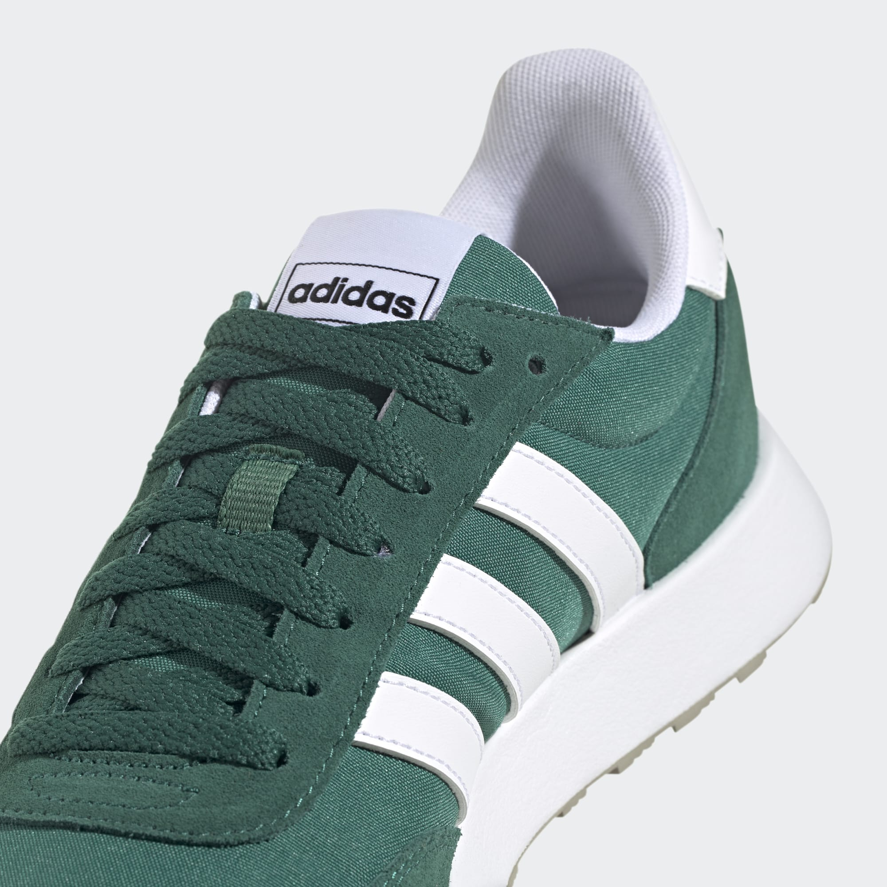

# MOVI Website

> Move Different. — Supreme-style shoe brand website.

## 📁 Files

```
movi-website/
├── index.html      ← Homepage (hero, featured drop, how it works)
├── drops.html      ← All drops archive
├── preorder.html   ← Preorder form
├── about.html      ← Brand story
├── style.css       ← All styles
├── main.js         ← Nav, scroll animations
└── README.md
```

---

## 🚀 GitHub Pages Setup (Free Hosting)

### Step 1 — Create GitHub Repo
1. Go to [github.com](https://github.com) → **New repository**
2. Name it exactly: `movi-website` (or your preferred name)
3. Set to **Public**
4. **Do NOT** add README (we have our own)
5. Click **Create repository**

### Step 2 — Upload Files
Option A (Easiest — drag & drop):
1. Open your repo on GitHub
2. Click **"uploading an existing file"**
3. Drag ALL files from the `movi-website/` folder
4. Click **Commit changes**

Option B (Git command line):
```bash
cd movi-website
git init
git add .
git commit -m "initial: MOVI website launch"
git remote add origin https://github.com/YOUR_USERNAME/movi-website.git
git push -u origin main
```

### Step 3 — Enable GitHub Pages
1. Go to repo **Settings** → **Pages** (left sidebar)
2. Under **Source** → Select branch: `main`
3. Folder: `/ (root)`
4. Click **Save**
5. Wait ~60 seconds
6. Your site is live at: `https://YOUR_USERNAME.github.io/movi-website/`

### Step 4 — Custom Domain (Optional, Free)
If you have a domain (e.g., `movibrand.com`):
1. In **Settings → Pages → Custom domain** → enter your domain
2. At your domain registrar, add a CNAME record:
   - Name: `www`
   - Value: `YOUR_USERNAME.github.io`
3. Also add A records pointing to GitHub Pages IPs

---

## 📦 Preorder Form — Backend Setup

Currently the form saves to `localStorage` (browser only). To collect real orders:

### Option 1 — Formspree (Free, Easiest)
1. Go to [formspree.io](https://formspree.io) → create free account
2. Create a form → get your form ID (e.g., `xpzvgkra`)
3. In `preorder.html`, replace the `submitOrder()` function's fetch with:
```javascript
const res = await fetch('https://formspree.io/f/YOUR_FORM_ID', {
  method: 'POST',
  headers: { 'Content-Type': 'application/json' },
  body: JSON.stringify({ name, phone, email, size, color, address, payment })
});
```
4. Orders arrive in your email instantly

### Option 2 — Google Sheets (Free, Recommended)
1. Create a Google Form with all fields
2. Link it to a Google Sheet
3. Embed or link the form from your preorder page

---

## 🎨 Customization

### Change prices
Search for `৳3,499` in the HTML files and update.

### Change drop quantity
Search for `200 pairs` and update.

### Add product photos
Replace `.img-placeholder` / `.drop-card-img` sections with:
```html

```
Create an `images/` folder and upload your product photos.

### Change preorder close date
In `preorder.html`, find:
```javascript
const closeDate = new Date('2025-09-01T00:00:00');
```
Update the date.

---

## 📱 Pages

| Page | URL | Purpose |
|------|-----|---------|
| Home | `/index.html` | Hero, featured drop, how it works |
| Drops | `/drops.html` | All drops archive |
| Preorder | `/preorder.html` | Order form |
| About | `/about.html` | Brand story |

---

## ✉️ Contact Integration

Replace `hello@movibrand.com` in the footer with your actual email.

---

**MOVI — Move Different.**
